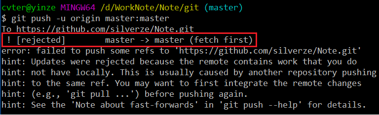

# git 学习笔记

## 解决上传冲突

**产生冲突时，接收到的信息:**
   

```
# 停止提交，使用命令
$ git pull origin remotebranch:localbranch
# 更新后，再提交。
# 更新时产生自动merge信息时，应该直接退出编辑器。
$ git gl　看一下刚刚提交的版本号
# 还原本次修改内容
$ git reset --hard 本次修改之前版本
# 更新服务器代码到本地
$ git pull origin localbranch:remotebranch
# 直接cherry-pick刚才看到的版本号
git cherry-pick 本次修改版本
```
