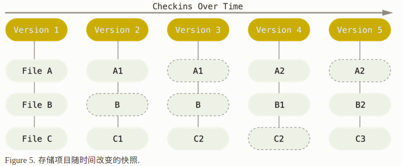
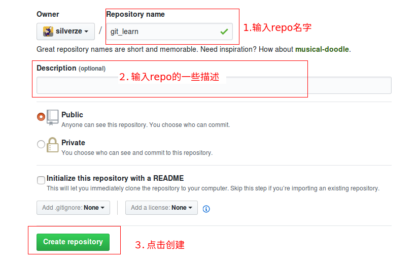
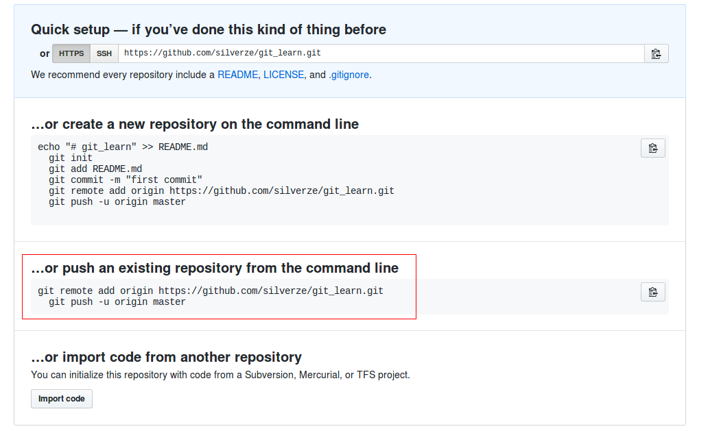

# git 学习笔记

## git基础知识
**git采用保存数据快照的方式保存文件**

* Version2中修改了　File A ，　File C　两个文件
* Version3中修改了　File C　文件  

**git中文件的三个状态**  
* Modified 已修改  
* Stage 已暂存
* Commited 已提交  

将已修的文件暂存: `git add filename`  
将已暂存的文件提交:`git commit `

## 初始化配置
```
git config --global user.email "you@example.com"
git config --global user.name "Your Name"
git config --global core.editor vim #设置提交信息编辑器为vim
```
## 将本地的一个新建的代码仓库上传至github
1. 首先在github上创建一个远程代码仓库  


2. 填写一些仓库的必要信息  


3. push 本地仓库至github 远程仓库  
```
git remote add origin "url"
git push -u origin master
```

其实在创建好repo后，github 上就有相应的上传提示:  
  


### 命令解释  

**推送修改至远程仓库**  
 `git push -u origin master:master`  
 **疑问？** 上面的两个master 哪一个是本地分支，哪一个是远程分支
答：第一个master为本地分支，第二个master为远程分支

**修改最近一次，没有push至远程仓库的commit信息**  
`git commit --amend`

**检查当前的git配置信息**  
`git config --list`  

**clone远程仓库至本地，并给本地仓库命名**  
 `git clone [url] local_repo_name`  

**git status会列出当前仓库中的详细信息，想要简短的信息：**  
`git status -s 或者　git status --short`  

**git diff 命令：**
```
git diff只显示尚未暂存的改动，而不是自上次提交以来所做的所有改动。
所以有时候你一下子暂存了所有更新过的文件后，
运行git diff后却什么也没有，就是这个原因。
git diff --staged 也只显示暂存区与上次提交的改动
```

**通过编辑.gitignore忽略掉工作目录下的文件一些,实例:**  
```
# no .a files
*.a

# but do track lib.a, even though you're ignoring .a files above
!lib.a

# only ignore the TODO file in the current directory, not subdir/TODO
/TODO

# ignore all files in the build/ directory
build/

# ignore doc/notes.txt, but not doc/server/arch.txt
doc/*.txt

# ignore all .pdf files in the doc/ directory
doc/**/*.pdf
```
**Tip:** GitHub 有一个十分详细的针对数十种项目及语言的 .gitignore 文件列表，你可以在 https://github.com/github/gitignore 找到它
