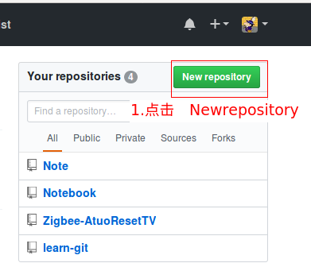

# git 学习笔记

## 初始化配置
```
git config --global user.email "you@example.com"
git config --global user.name "Your Name"
git config --global core.editor vim #设置提交信息编辑器为vim
```
## 将本地的一个新建的代码仓库上传至github
1. 首先在github上创建一个远程代码仓库  


2. 填写一些仓库的必要信息  


3. push 本地仓库至github 远程仓库  
```
git remote add origin "url"
git push -u origin master
```
**第二步中不选择　Initialize this repository with a README** 在创建好repo后，github 上就有相应的上传提示:  
  

### 推送修改至远程仓库  
`git push -u origin master:master`

**疑问？** 上面的两个master 哪一个是本地分支，哪一个是远程分支
答：第一个master为本地分支，第二个master为远程分支

### 修改最近一次，没有push至远程仓库的commit信息  
`git commit --amend`
